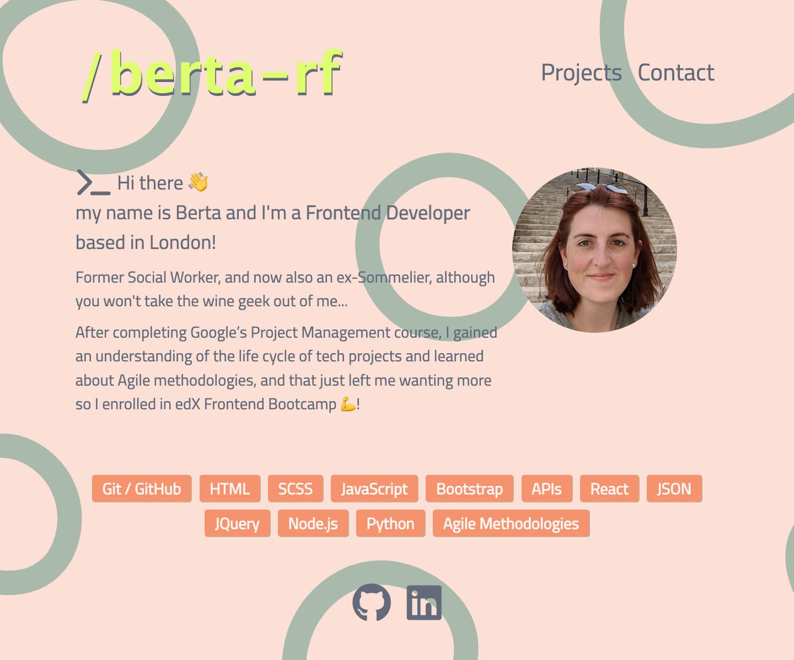

# React Portfolio

[](https://app.netlify.com/sites/berta-rf-portfolio/deploys)


</br>

## 🎯 Description
This is my professional portfolio build with React, styled with React-Bootstrap and SCSS, and deployed on Netlify.</br>
The Project Gallery is generated dynamically from a projects.json file.</br>
The Contact section has links to all my socials and ways to contact me, and a contact form managed through Netlify's built-in form handling.

</br>




</br>

### Table of Contents

<!-- - [🛠 Installation](#-installation)
- [💻 Usage](#-usage)
- [🔍 Tests](#-tests) -->
- [💬 Questions](#-questions)
- [🤝 Credits](#-credits)
- [💪 Contributing](#-contributing)
- [📖 License](#-license)


</br>

<!-- ## 🛠 Installation

To use this application you will need to install dependencies by entering the following command on your terminal:

```
npm install
```

</br> 

<!-- ## 💻 Usage

The application is invoked by entering the following command on your terminal:

```
node index
```

</br> -->


</br>
<!-- 
## 🔍 Tests

<!-- To run tests enter this command on your terminal:

```
npm test
```

</br> --> 

## 💬 Questions

Contact me if you have any questions!

- Drop me an email [bertaromanofernandez@gmail.com](mailto:bertaromanofernandez@gmail.com)
- Check out my GitHub profile [berta-rf](https://github.com/berta-rf)
- Frontend Mentor [@berta-rf](https://www.frontendmentor.io/profile/)
- LinkedIn [Berta Romano Fernandez](https://www.linkedin.com/in/berta-rf)

</br>

## 🤝 Credits

* [Netlify](https://www.netlify.com/)
* [Responsive Navbar using React Bootstrap](https://medium.com/swlh/responsive-navbar-using-react-bootstrap-5e0e0bd33bd6)
* [How to Add a Netlify Form to a React App](https://www.freecodecamp.org/news/how-to-add-a-netlify-form-to-a-react-app/)
* [Khroma Color palette generator](https://www.khroma.co/generator)
* [Haikei SVG generator](https://app.haikei.app/)

</br>

## 💪 Contributing

Contributions are what make the open source community such an amazing place to learn, inspire, and create. Any contributions you make are **greatly appreciated**.

If you have a suggestion that would make this better, please fork the repo and create a pull request. You can also simply open an issue with the tag "enhancement".

1. Fork the Project
2. Create your Feature Branch (`git checkout -b feature/AmazingFeature`)
3. Commit your Changes (`git commit -m 'Add some AmazingFeature'`)
4. Push to the Branch (`git push origin feature/AmazingFeature`)
5. Open a Pull Request

</br>

## 📖 License

This project is licensed under the terms of the **MIT License**. See [LICENSE](LICENSE) for more information.


